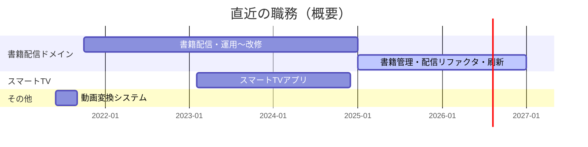

# スキルシート（S・N）

職務用のスキルシートを Markdown で管理するリポジトリです。

## 本文

**[スキルシートを読む（`skill_sheet_202603_SN.md`）](./skill_sheet_202603_SN.md)**

## 職務経歴（概要・図）

```mermaid
gantt
    title 直近の職務（概要）
    dateFormat YYYY-MM
    axisFormat %Y-%m

    section 書籍配信ドメイン
    書籍配信・運用〜改修 :2021-10, 2025-01
    書籍管理・配信リファクタ・刷新 :active, 2025-01, 2027-01

    section スマートTV
    スマートTVアプリ :2023-02, 2024-12

    section その他
    動画変換システム :2021-06, 2021-09
```

※ 同一時期に別案件が並行している場合があります（図は便宜上の区切りです）。
