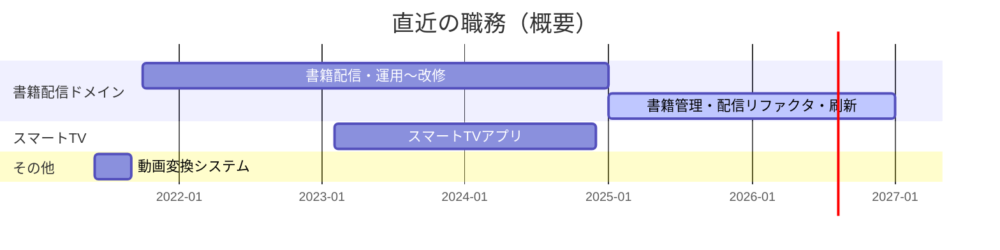

# スキルシート（S・N）

[](https://snklab77.github.io/my-skill-sheet/)
[](https://www.php.net/)
[](https://laravel.com/)
[](https://www.typescriptlang.org/)
[](https://react.dev/)
[](https://aws.amazon.com/)
[](https://www.docker.com/)

職務用のスキルシートを Markdown で管理するリポジトリです。

## 公開・本文

- **公開サイト（GitHub Pages）:** [https://snklab77.github.io/my-skill-sheet/](https://snklab77.github.io/my-skill-sheet/)
- **スキルシート:** ファイル名は [docs/_data/skill_sheet.yml](docs/_data/skill_sheet.yml) の `file`（[skill_sheet.env](skill_sheet.env) の `SKILL_SHEET_FILE` と同じ）。リポジトリ直下のその名前の `.md` が本文
- **`skill_sheet.yml` と `skill_sheet.env`:** Jekyll は前者を読む。後者は同じ内容を `KEY=value` 形式で置いたもの（ほかのツールが値だけ取りたいとき用）。**普段ターミナルで `source` する必要はない**（`source` は Linux/mac の bash などのコマンドで、Windows の PowerShell にはない）

## 職務経歴（概要・図）



※ 同一時期に別案件が並行している場合があります（図は便宜上の区切りです）。

## ページの開発手順

### 環境構築（`docs/` の Jekyll を動かすまで）

1. [Ruby](https://www.ruby-lang.org/) 3.4 系と Bundler(`gem install bundler`)
  Windowsの場合 は [RubyInstaller](https://rubyinstaller.org/) の **3.4.x WITH DEVKIT**
2. リポジトリで `cd docs` のあと `bundle install`
3. Windows で `MSYS2 could not be found` になるときは `ridk install` で MSYS2 / ツールチェーンを入れてから、もう一度 `bundle install`（ネイティブ拡張の gem が最後まで入らないと `jekyll` が見つからない）

### ローカルプレビュー

```bash
cd docs
bundle exec jekyll serve
```

ブラウザで **http://127.0.0.1:4000/**（表示に従う）

本番と同じ `baseurl`（`/my-skill-sheet`）で見る場合:

```bash
bundle exec jekyll serve --baseurl /my-skill-sheet
```

→ **http://127.0.0.1:4000/my-skill-sheet/**

`docs/index.md` の `{{ site.github.* }}` はローカルでは空になりやすい。GitHub 上のビルドでは Actions が環境を渡すため埋まる。

### スキルシートの版・日付・ファイル名（コミット前）

コミット時に自動書き換えはしない。版を揃えたいときだけ、コミット前に:

```bash
python scripts/update_skill_sheet_meta.py
```

（`python3` のみなら `python3 scripts/...`）。差分を確認してから `git add` → `git commit`。Python 3 と標準ライブラリのみ。

スキルシートの「最終更新」は **日付 + 同日通し番号**（例 `2026-04-10 #2`）。スクリプトを走らせるたびに同日なら番号が増える。あわせて上記の **`skill_sheet.yml` / `skill_sheet.env` だけ**を書き換える（本文中のファイル名をリポジトリ全体で検索置換はしない）。
